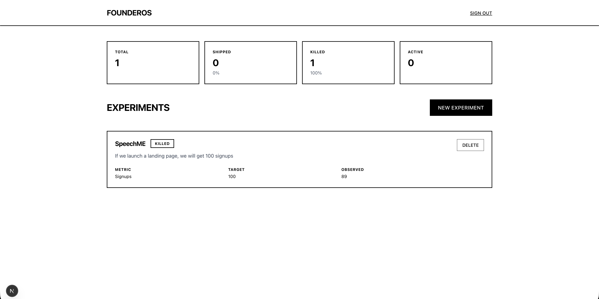

# FounderOS

**Transform experiments into deterministic decisions.**

FounderOS is a full-stack web application that enforces decision-making for solo founders and small startup teams. Instead of relying on gut feelings, FounderOS automatically evaluates experiment outcomes and categorizes them as Shipped or Killed based on measurable metrics.



## Demo

[Watch Demo Video](your-demo-link-here)

[Live Application](https://founderos-iota.vercel.app/)

## Features

### Core Functionality
- **Experiment Tracking**: Create and organize experiments with clear hypotheses, metrics, and target outcomes
- **Automated Decision Engine**: Server-side logic that automatically determines experiment success by comparing observed vs. target values
- **Real-time Metrics Dashboard**: View statistics on shipped, killed, and active experiments at a glance
- **User Authentication**: Secure email/password authentication with user-scoped data access

### Key Innovation
The decision engine removes subjectivity from the evaluation process. When you submit experiment results, the backend automatically categorizes outcomes as:
- **Shipped**: Observed value meets or exceeds target
- **Killed**: Observed value falls below target

This transforms subjective assessment into deterministic, reproducible logic.

## Tech Stack

### Frontend
- **Next.js 15** (App Router)
- **React 18**
- **TypeScript**
- **Tailwind CSS** 

### Backend
- **Next.js Server Actions**
- **PostgreSQL** (via Supabase)
- **Supabase Auth** for authentication
- **Row Level Security (RLS)** for data isolation

### Infrastructure
- **Supabase** for database and authentication
- **Vercel** for deployment
- **Git** for version control

## Technical Architecture
```
┌─────────────────────────────────────────────────────┐
│                   Client Layer                       │
│  (Next.js App Router + React Components)            │
└─────────────────┬───────────────────────────────────┘
                  │
                  │ Server Actions
                  │
┌─────────────────▼───────────────────────────────────┐
│                 Server Layer                         │
│  - Authentication Logic                              │
│  - Experiment CRUD Operations                        │
│  - Decision Engine (Shipped/Killed Logic)            │
└─────────────────┬───────────────────────────────────┘
                  │
                  │ Supabase Client
                  │
┌─────────────────▼───────────────────────────────────┐
│              Database Layer                          │
│  - PostgreSQL                                        │
│  - Row Level Security Policies                       │
│  - User-scoped Data Access                           │
└─────────────────────────────────────────────────────┘
```

## Database Schema
```sql
create type experiment_status as enum ('active', 'shipped', 'killed');

create table experiments (
  id uuid default uuid_generate_v4() primary key,
  user_id uuid references auth.users(id) on delete cascade not null,
  title text not null,
  hypothesis text not null,
  metric_name text not null,
  target_value numeric not null,
  observed_value numeric,
  status experiment_status default 'active' not null,
  result_summary text,
  created_at timestamp with time zone default timezone('utc'::text, now()) not null,
  updated_at timestamp with time zone default timezone('utc'::text, now()) not null
);
```

## Decision Engine Logic

The core innovation of FounderOS is its deterministic decision engine:
```typescript
// Automatic status determination
const status: ExperimentStatus = observed_value >= target_value 
  ? 'shipped'  // Success: Met or exceeded target
  : 'killed'   // Failure: Below target
```

This simple yet powerful logic:
- Removes human bias from evaluation
- Creates reproducible results
- Forces accountability to predefined metrics
- Enables data-driven iteration

## Installation

### Prerequisites
- Node.js 18+
- npm or yarn
- Supabase account

### Setup

1. **Clone the repository**
```bash
git clone https://github.com/ManilMehta/founderos.git
cd founderos
```

2. **Install dependencies**
```bash
npm install
```

3. **Set up Supabase**
- Create a new project at [supabase.com](https://supabase.com)
- Run the database schema (see Database Schema section above)
- Configure Row Level Security policies
- Disable email confirmation for development (Authentication > Providers > Email)

4. **Configure environment variables**

Create `.env.local`:
```
NEXT_PUBLIC_SUPABASE_URL=your_project_url
NEXT_PUBLIC_SUPABASE_ANON_KEY=your_anon_key
```

5. **Run development server**
```bash
npm run dev
```

Visit `http://localhost:3000`

## Deployment

### Vercel (Recommended)

1. Push code to GitHub
2. Import repository to Vercel
3. Add environment variables in Vercel dashboard
4. Deploy

The app will be live at your Vercel URL.

## Usage

### Creating an Experiment
1. Sign up or log in to your account
2. Click "NEW EXPERIMENT" on the dashboard
3. Fill in:
   - **Title**: Brief name for your experiment
   - **Hypothesis**: What you're testing and expected outcome
   - **Metric Name**: What you're measuring (e.g., "Signups", "Revenue")
   - **Target Value**: The threshold for success

### Submitting Results
1. When your experiment concludes, click "SUBMIT" on the active experiment
2. Enter the observed value
3. The system automatically determines:
   - **Shipped** if observed ≥ target
   - **Killed** if observed < target

### Viewing Metrics
The dashboard displays:
- Total experiments run
- Number and percentage shipped
- Number and percentage killed  
- Currently active experiments

## Design Philosophy

FounderOS embraces a brutalist, monochrome design system:
- **Black and white only**: No colors, no distractions
- **Sharp edges**: No rounded corners
- **Bold typography**: Clear hierarchy and readability
- **Heavy borders**: Strong visual boundaries
- **Minimal UI**: Only essential elements

This design enforces focus on data and decisions, not aesthetics.

## Security

- **Row Level Security**: Users can only access their own experiments
- **Server-side validation**: All mutations happen server-side
- **Secure authentication**: Supabase Auth with email/password
- **Environment variables**: Sensitive keys never exposed to client

## Future Enhancements

- AI-generated experiment learnings (OpenAI integration)
- Export experiments to CSV
- Team collaboration features
- Experiment templates
- Advanced filtering and search
- Chart visualizations

## Contributing

Contributions welcome! Please:
1. Fork the repository
2. Create a feature branch
3. Commit your changes
4. Push to the branch
5. Open a Pull Request

## License

MIT License - feel free to use this project for personal or commercial purposes.

## Author

**Your Name**
- GitHub: [@ManilMehta](https://github.com/ManilMehta)
- LinkedIn: [Manil Mehta](https://linkedin.com/in/ManilMehta)
- Website: [manilmehta.com](https://manilmehta.com)

## Acknowledgments

- Built with [Next.js](https://nextjs.org/)
- Database and auth by [Supabase](https://supabase.com/)
- Deployed on [Vercel](https://vercel.com/)

---

**FounderOS** - Stop guessing. Start deciding.